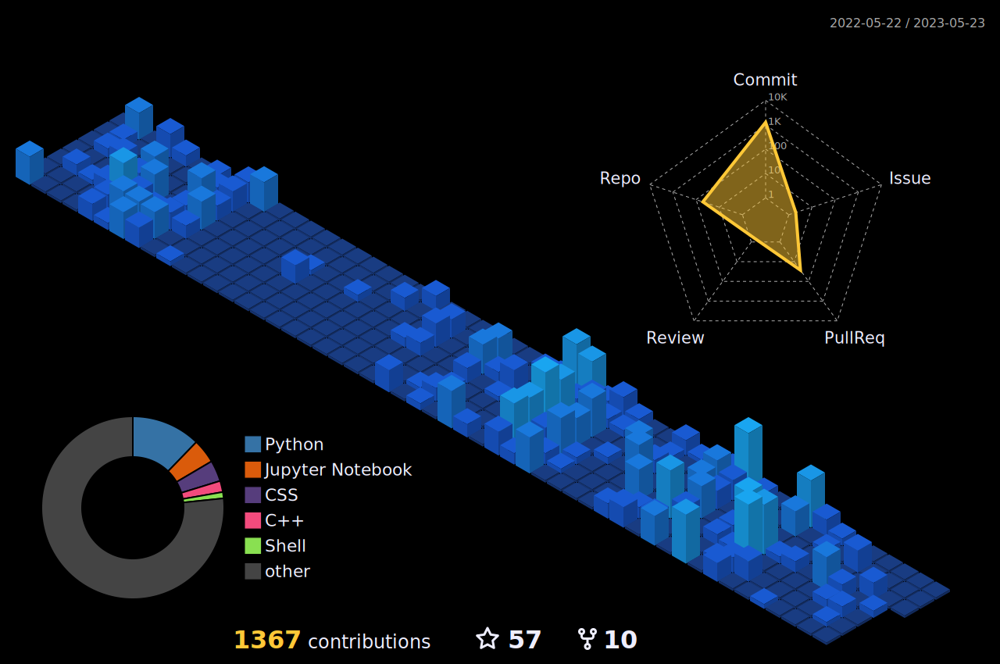

 &nbsp; </a>

     

<h2>I've worked with</h2>

<h2>GitHub Profile Summary</h2>

      <picture>
    <source srcset="https://github-readme-stats.vercel.app/api?username=ShadmanShariar&show_icons=true&hide_border=true" media="(prefers-color-scheme: light)" width="47%" />
    
  </picture>
  <picture>
    <source media="(prefers-color-scheme: light)" srcset= "https://github-readme-streak-stats.herokuapp.com?user=ShadmanShariar&theme=default&hide_border=true" width="50%">
    
  </picture>
  <picture>
    <source media="(prefers-color-scheme: light)" srcset="profile-custom-season.svg" width = "98%">
    
  </picture>

  

